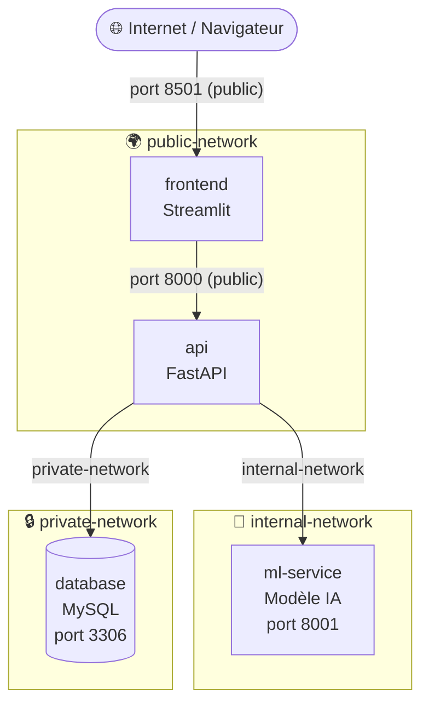

# 🪄 Face Recognition Docker — Harry Potter Character Recognizer

> Application web de reconnaissance faciale des personnages **Harry Potter**, déployée en architecture **microservices Docker sécurisée**.

<p align="center">
  
  
  
  
  
</p>

---

## ⚙️ Fonctionnement en 3 étapes

1. L'utilisateur **upload une photo** via l'interface web
2. L'image est analysée par un **modèle d'intelligence artificielle**
3. Le résultat (**nom du personnage + score de confiance**) s'affiche à l'écran et est enregistré en base de données

---

## 🏗️ Architecture — 4 services

Le projet est découpé en **4 services indépendants**, chacun dans son propre conteneur Docker :

| Service | Technologie | Port | Visibilité |
| :--- | :--- | :--- | :--- |
| `frontend` | Interface web Streamlit | `8501` | 🌍 Public |
| `api` | Serveur API REST (FastAPI) | `8000` | 🌍 Public |
| `ml-service` | Modèle IA de reconnaissance | `8001` | 🔒 Interne |
| `database` | Base de données MySQL | `3306` | 🔒 Interne |

### Rôle de chaque service

| Service | Rôle |
| :--- | :--- |
| **frontend** | Affiche l'interface utilisateur, envoie l'image à l'API |
| **api** | Reçoit l'image, orchestre l'analyse et sauvegarde le résultat |
| **ml-service** | Charge le modèle IA et retourne le personnage identifié |
| **database** | Stocke toutes les prédictions (MySQL 8.0) |

---

## 🔐 Sécurité réseau — Architecture multi-réseaux

### Pourquoi 3 réseaux distincts ?

Un réseau Docker unique permettrait à tous les services de se voir et de communiquer entre eux librement. Cela crée des vulnérabilités : **si un service est compromis, l'attaquant aurait accès à l'ensemble du système**, y compris la base de données.

Pour éviter cela, nous avons segmenté le réseau en **3 zones distinctes**, chacune avec un périmètre d'accès strict.

### Les 3 réseaux

#### 🌍 `public-network` — `frontend` ↔ `api`
Réseau exposé à l'utilisateur. Seuls le frontend et l'API y ont accès. Permet à l'interface d'envoyer des requêtes à l'API.

#### 🔧 `internal-network` — `api` ↔ `ml-service`
Réseau interne pour la communication entre l'API et le modèle IA. Le modèle IA n'est **jamais accessible** depuis l'extérieur ni depuis le frontend directement.

#### 🔒 `private-network` — `api` ↔ `database`
Réseau privé et isolé pour la base de données. **Seule l'API** peut lire et écrire dans MySQL. Le frontend et le ml-service n'ont **aucun accès** à la base de données.

### Récapitulatif des accès par service

| Service | `public-network` | `internal-network` | `private-network` |
| :--- | :---: | :---: | :---: |
| **frontend** | ✅ | ❌ | ❌ |
| **api** | ✅ | ✅ | ✅ |
| **ml-service** | ❌ | ✅ | ❌ |
| **database** | ❌ | ❌ | ✅ |

Ce tableau montre clairement que :

- ➡️ La base de données n'est accessible que par l'**API**
- ➡️ Le modèle IA n'est accessible que par l'**API**
- ➡️ Le frontend ne peut parler qu'à l'**API**, jamais directement à la BDD ou au modèle

---

## 🔄 Schéma complet de communication



**Résumé du flux :**

| Étape | Communication | Réseau |
| :--- | :--- | :--- |
| 1 | Navigateur → `frontend:8501` | — |
| 2 | `frontend` → `api:8000` | public-network |
| 3 | `api` → `ml-service:8001` | internal-network |
| 4 | `api` → `database:3306` | private-network |

---

## 🗄️ Base de données

**Nom de la base :** `hpdb` (MySQL 8.0)

**Table : `predictions`**

| Colonne | Type | Contrainte | Description |
| :--- | :--- | :--- | :--- |
| `id` | `INT` | PK, AUTO_INCREMENT | Identifiant unique |
| `character_name` | `VARCHAR(100)` | NOT NULL | Personnage reconnu |
| `confidence` | `FLOAT` | NOT NULL | Score de confiance (0 → 1) |
| `created_at` | `TIMESTAMP` | DEFAULT NOW() | Horodatage automatique |

> 💾 Les données sont persistées dans un **volume Docker** (`mysql_data`) — elles survivent aux redémarrages des conteneurs.

---

## 📁 Structure des fichiers

```
Face-recognition-docker/
├── docker-compose.yml          ← Orchestration de tous les services
├── .env                        ← Variables sensibles (ne pas committer !)
├── .gitignore
│
├── frontend/                   ← Interface utilisateur
│   ├── app.py                  ← Application Streamlit principale
│   ├── Dockerfile
│   ├── requirements.txt        ← streamlit, requests, Pillow
│   └── tests/
│       └── test_app.py
│
├── api/                        ← Serveur API REST
│   ├── main.py                 ← Endpoints FastAPI
│   ├── Dockerfile
│   └── ...
│
├── ml-service/                 ← Modèle de reconnaissance
│   ├── model/
│   │   ├── harry_model.pkl     ← Modèle entraîné
│   │   └── metadata.json       ← Métadonnées du modèle
│   └── Dockerfile
│
└── database/
    ├── init.sql                ← Création de la base et des tables
    └── tests/
        └── test_schema.sql
```

---

## 🔧 Variables d'environnement

Créez un fichier `.env` à la racine du projet (**jamais versionné sur Git**) :

```env
# Base de données
DB_ROOT_PASSWORD=<mot_de_passe_root>
DB_NAME=hpdb
DB_USER=appuser
DB_PASSWORD=<mot_de_passe_utilisateur>

# Modèle IA
MODEL_PATH=/app/model/harry_model.pkl
METADATA_PATH=/app/model/metadata.json
```

---

## 📋 Prérequis

- **Docker Engine** ≥ 20.0
- **Docker Compose** ≥ 2.0
- **RAM** : 4 Go minimum recommandés (pour le modèle IA)
- **Espace disque** : ~2-3 Go (images Docker)

---

## 🚀 Installation et lancement

**1. Cloner le dépôt**

```bash
git clone https://github.com/pau-anto/Face-recognition-docker.git
cd Face-recognition-docker
git checkout structure-docker
```

**2. Créer le fichier `.env`** avec vos variables (voir section ci-dessus)

```bash
cp .env.example .env    # si disponible, sinon créez-le manuellement
```

**3. Construire et lancer tous les services**

```bash
docker compose up --build
```

**4. Accéder à l'application** → http://localhost:8501

### Commandes utiles

```bash
# Lancer en arrière-plan
docker compose up -d --build

# Vérifier l'état des services
docker compose ps

# Consulter les logs d'un service
docker compose logs api
docker compose logs ml-service

# Arrêter tous les services
docker compose down

# Arrêter et supprimer les volumes (⚠ efface les données MySQL)
docker compose down -v
```

---

## 🛠️ Technologies utilisées

| Technologie | Version | Rôle |
| :--- | :--- | :--- |
| **Python** | 3.11 | Langage principal |
| **Streamlit** | 1.32.0 | Interface utilisateur web |
| **FastAPI** | — | API REST (service api) |
| **Pillow** | 10.2.0 | Traitement d'images |
| **requests** | 2.31.0 | Appels HTTP entre services |
| **MySQL** | 8.0 | Base de données |
| **Docker** | ≥ 20.0 | Containerisation |
| **Docker Compose** | ≥ 2.0 | Orchestration des services |

---

**Projet académique — Conteneurisation logicielle (docker) - 4IABD**
